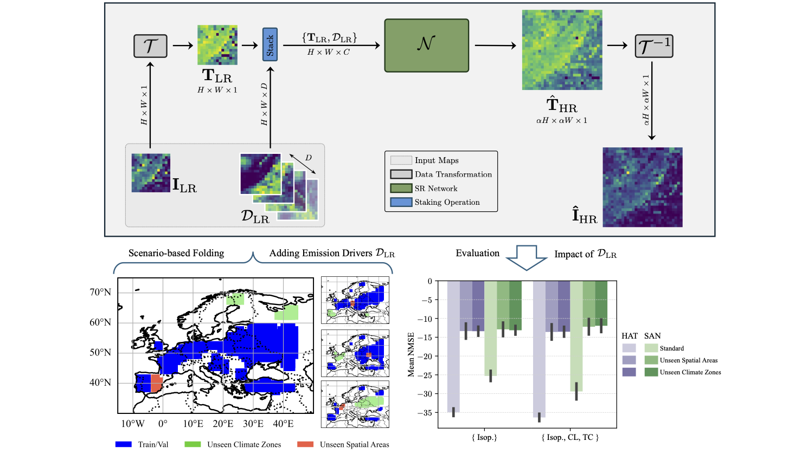
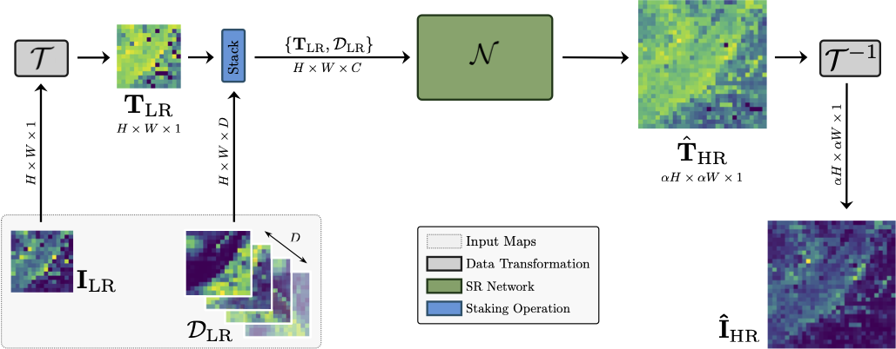
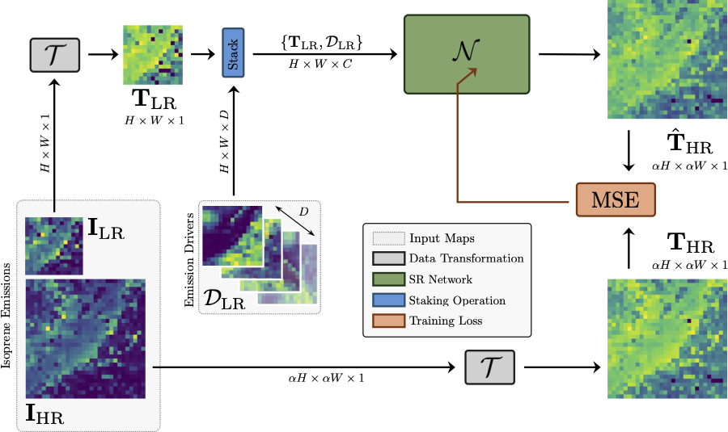

# SR-BVOC-LC

This repository contains the code implementation for the paper: "[Leveraging Land Cover Priors for Isoprene Emission Super-Resolution](https://www.mdpi.com/2072-4292/17/10/1715)"
## Table of Contents

- [Overview](#overview)
- [Installation](#installation)
- [Requirements](#requirements)
- [Project Structure](#project-structure)
- [Usage](#usage)
- [Data Inventories](#data-inventories)
- [Citation](#citation)
- [License](#license)
- [Misc](#misc)

## Overview
### Graphical Abstract


### Abstract
Satellite remote sensing plays a crucial role in monitoring Earth’s ecosystems, yet
satellite-derived data often suffer from limited spatial resolution, restricting the availability
of accurate and precise data for atmospheric modeling and climate research. Errors and
biases may also be introduced into applications due to the use of data with insufficient
spatial and temporal resolution. In this work, we propose a deep learning-based Super-
Resolution (SR) framework that leverages land cover information to enhance the spatial
accuracy of Biogenic Volatile Organic Compound (BVOC) emissions, with a particular
focus on isoprene. Our approach integrates land cover priors as emission drivers, captur-
ing spatial patterns more effectively than traditional methods. We evaluate the model’s
performance across various climate conditions and analyze statistical correlations between
isoprene emissions and key environmental information such as cropland and tree cover
data. Additionally, we assess the generalization capabilities of our SR model by applying
it to unseen climate zones and geographical regions. Experimental results demonstrate
that incorporating land cover data significantly improves emission SR accuracy, particu-
larly in heterogeneous landscapes. This study contributes to atmospheric chemistry and
climate modeling by providing a cost-effective, data-driven approach to refining BVOC
emission maps. The proposed method enhances the usability of satellite-based emissions
data, supporting applications in air quality forecasting, climate impact assessments, and
environmental studies.

### System
Deployment:



Training:



## Installation
Clone this repository to your local machine:
```bash
git clone https://github.com/polimi-ispl/sr-bvoc-lc
```

## Requirements
All the required packages are contained in the ```bvoc-fusionsr-env.yml``` file.

You can install all the packages using [Conda](https://docs.conda.io/projects/conda/en/latest/index.html), by executing the following commands:

```bash
conda env create -f bvoc-fusionsr-env.yml
conda activate bvoc-fusionsr-env
```

More info [here](https://docs.conda.io/projects/conda/en/latest/user-guide/tasks/manage-environments.html#creating-an-environment-from-an-environment-yml-file).

## Project Structure
```
<usr_dir>
├── data
│	 ├── koppen_geiger
│	 ├── SEEDS
│	 └── worldcover
├── dataset_generation
│	 ├── SEEDS/
|            ├── HR_gen.py
|            └── LR_gen.py
│	 ├── partition_generation_climate.py
│	 └── utils.py
├── datasets              # Datasets folder generated by dataset_generation
│	 ├── <dataset_name>
|            ├── HR/
|            ├── LR/
|            ├── partition_indices
|            └── dataset_index
├── sr						# Super-Resolution folder
│	 ├── <models>/
│	 ├── dataset.py
│	 ├── train.py
│	 ├── test.py
│	 └── utils.py
├── runs/ 					# Runs folder
│	 ├── logs/				     # Tensorboard logs folder
│	 ├── <dataset_name>
│	 	   └── <sr_factor>/<model>       # Model Parameters and Output			
├── bvoc-fursionsr-env.yaml			# Conda environment settings		
└── README.md
```

## Data Inventories
- The TD-TROPO-010 isoprene emission inventory is available at [here](https://www.seedsproject.eu/data/top-down-isoprene-emissions) (accessed on 14 March 2025).
- The LAI-TROPO-010 inventory is available at [here](https://www.seedsproject.eu/data/lai-ol) (accessed on 14 March 2025). 
- The LC-ESA inventory is available at [here](https://zenodo.org/records/7254221) (accessed on 14 March 2025).
- The CZ-KG-010 inventory is available at [here](https://www.gloh2o.org/koppen/) (accessed on 14 March 2025).

## Usage

Training:
```bash
python train.py \
        --model_name ${MODEL_NAME} \
        --gpu_id ${GPU_ID} \
        --n_epochs ${N_EPOCHS} \
        --batch_size ${BATCH_SIZE} \
        --dataset_folder ${DATASET_FOLDER} \
        --partition_file ${PARTITION_FILE} \
        --channels ${CHANNELS} \
        --fusion_flag ${FUSION_FLAG} #"ref", "AG", "FOREST", or "all"
```
Test:
```bash
python test.py \
            --gpu_id ${GPU_ID} \
            --model_name ${MODEL_NAME} \
            --run_name ${RUN_NAME} \ # <dataset_name>/<sr_factor>/<model>/<run_name> to test
            --train_dataset_folder ${DATASET_NAME} \
            --channels ${CHANNELS} \
            --batch_size ${BATCH_SIZE} \
            --test_type ${TYPE} # "test" or "spatial" or "climate"
```

## Citation
```bibtex
@article{ummerle2025srbvoclc,
AUTHOR = {Ummerle, Christopher and Giganti, Antonio and Mandelli, Sara and Bestagini, Paolo and Tubaro, Stefano},
TITLE = {Leveraging Land Cover Priors for Isoprene Emission Super-Resolution},
JOURNAL = {Remote Sensing},
VOLUME = {17},
YEAR = {2025},
NUMBER = {10},
ARTICLE-NUMBER = {1715},
URL = {https://www.mdpi.com/2072-4292/17/10/1715},
ISSN = {2072-4292},
DOI = {10.3390/rs17101715}
}
```

## License
This project is licensed under the MIT License.

## Misc
- SAN network is built on [SAN](https://github.com/daitao/SAN).
- HAT network is built on [HAT](https://github.com/XPixelGroup/HAT).

### 👥 About Us
- Image and Sound Processing Lab ([ISPL](http://ispl.deib.polimi.it/))
- Department of Electronics, Information and Bioengineering ([DEIB](https://www.deib.polimi.it/eng/home-page))
- [Politecnico di Milano](https://www.polimi.it/en)
- Christopher Ummerle, [LinkedIn](www.linkedin.com/in/christopher-ummerle)
- Antonio Giganti, [ResearchGate](https://www.researchgate.net/profile/Antonio-Giganti), [LinkedIn](https://www.linkedin.com/in/antoniogiganti/)
- Sara Mandelli, [ResearchGate](https://www.researchgate.net/profile/Sara-Mandelli), [LinkedIn](https://www.linkedin.com/in/saramandelli/)
- Paolo Bestagini, [LinkedIn](https://www.linkedin.com/in/paolo-bestagini-390b461b4/)
- Stefano Tubaro, [ResearchGate](https://www.researchgate.net/profile/Stefano-Tubaro), [LinkedIn](https://www.linkedin.com/in/stefano-tubaro-73aa9916/)

### 📑 Our BVOC Related Works

A collection of the works from our team focused on BVOC emissions are available at [https://github.com/polimi-ispl/sr-bvoc]
